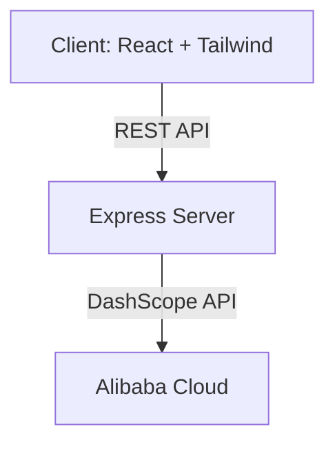

<div align="center">

# 🖼️ Synthia: AI-Powered Image Editing & Generation
### _"Transform your visuals. Unleash creativity with AI."_


<!-- Demo GIF or Screenshot -->

<!-- Replace with a GIF or demo screenshot for extra wow! -->
<!--  -->

</div>

---

## 🚨 Problem

> _“Creative teams and individuals struggle to edit, generate, and repurpose images quickly for marketing, social media, and presentations. Manual tools are slow, expensive, and lack AI-powered flexibility.”_

---

## 💡 Solution

**Synthia** leverages Alibaba’s DashScope AI to deliver instant, high-quality image editing and generation. Upload, describe, and transform images in seconds—no design skills required. Perfect for marketers, educators, and creators!

---


---

## 🛠️ Tech Stack

<div align="center">

| Tech         | Badge/Logo                                                                 |
|--------------|---------------------------------------------------------------------------|
| React        |  |
| Express      |  |
| TailwindCSS  |  |
| DashScope API|  |
| Netlify      |  |

</div>

---

## ⚡ Impact & Future Scope

> _“Synthia democratizes creative AI, making advanced image editing accessible to everyone. Future plans: video editing, real-time collaboration, and integrations with popular platforms.”_

---

## 📦 Installation

```bash
git clone https://github.com/Manavarya09/theme001-new.git
cd theme001-new
npm install
```

---

## ▶️ Usage

```bash
npm run dev
```
- Open [http://localhost:5173](http://localhost:5173) in your browser.
- Upload an image, enter your edit prompt, and see instant results!
- Try light/dark mode toggle for a modern UI experience.
- Explore image generation and repurposing features for slides, social, or video.


---


---

## 📊 Architecture



---

## 🧑‍🤝‍🧑 Team Credits

| Name            | Role         | GitHub                        | LinkedIn                |
|-----------------|-------------|-------------------------------|-------------------------|
| Manavarya Singh | Lead Dev    | [GitHub](https://github.com/Manavarya09) | [LinkedIn](https://linkedin.com/in/manavaryasingh) |
| Ashmit Dhown    | Designer    | [GitHub](#)                   | [LinkedIn](#)           |
| Aaryan Gupta    | Developer   | [GitHub](#)                   | [LinkedIn](#)           |

---

## 📜 License

This project is licensed under the MIT License.

---

<div align="center">

⭐ **Star this repo if you like it!**  
🏅 _Submitted for [Alibaba CLoud Hackatthon 2025] — Team History Buffers_

</div>

---

_Ready to transform your images? Try Synthia now!_

---
